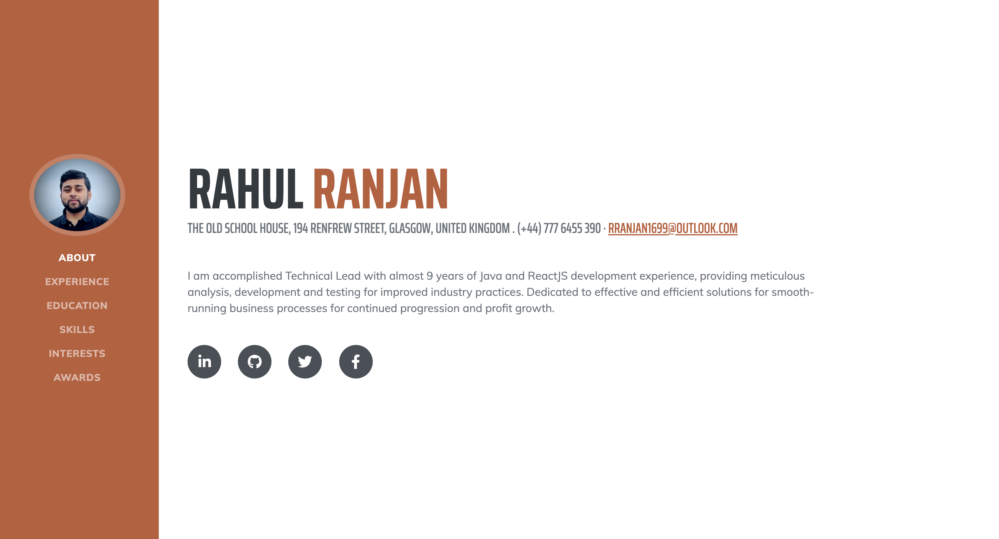

# [Rahul - Resume](https://www.ranjanresume.co.uk/)

[Resume](https://www.ranjanresume.co.uk/) is a resume created by Rahul Ranjan. This theme features a fixed sidebar with content sections to build a simple, yet elegant resume.

## Preview

**[View Live Preview](https://www.ranjanresume.co.uk/)**

## Installation

To begin using this resume, choose one of the following options to get started:

- [Download the latest version of resume](https://github.com/ranjanenterprises/ranjan-resume-web-app/)
- Install using npm: `npm i ranjan-resume-web-app`

## Usage

### Basic Usage

After downloading, simply edit the HTML and CSS files included with `dist` directory. These are the only files you need to worry about, you can ignore everything else! To preview the changes you make to the code, you can open the `index.html` file in your web browser.

#### npm Scripts

- `npm run build` builds the project - this builds assets, HTML, JS, and CSS into `dist`
- `npm run build:assets` copies the files in the `src/assets/` directory into `dist`
- `npm run build:pug` compiles the Pug located in the `src/pug/` directory into `dist`
- `npm run build:scripts` brings the `src/js/scripts.js` file into `dist`
- `npm run build:scss` compiles the SCSS files located in the `src/scss/` directory into `dist`
- `npm run clean` deletes the `dist` directory to prepare for rebuilding the project
- `npm run start:debug` runs the project in debug mode
- `npm start` or `npm run start` runs the project, launches a live preview in your default browser, and watches for changes made to files in `src`

You must have npm installed in order to use this build environment.

## Copyright and License

Copyright 2021 Ranjan Enterprises.
